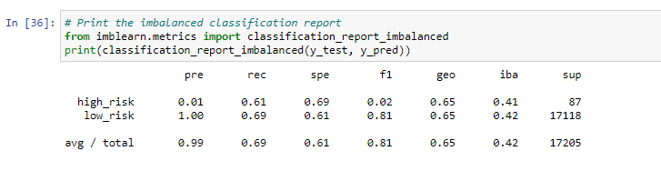
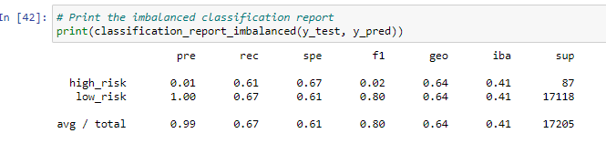
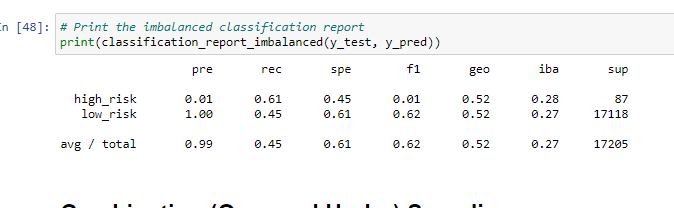
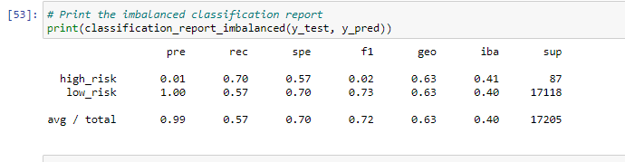
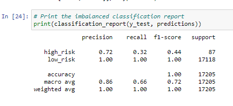
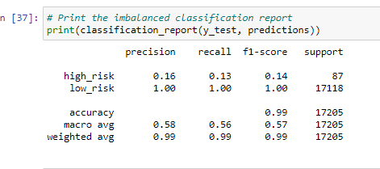

# Credit_Risk_Analysis

## Overview of the analysis

##### This analysis seeks to find the best model for predicting high credit risks by comparing various modeling methods. Ability to predict high credit risk is important for banks and financial institutions to be able to offer loans and mortgages while minimizing losses due to bad loans.

## Results

*   With the Random Oversampling method the high risk class has a precision of 0.01 which is too low to be useful for any prcatical purpose as it does not "catch" high-risk applications well enough. The recal rate of 0.61 also indicate that this method is unreliable for this application.

*   The SMOTE Oversampling method produced very similar numbers to the Random Oversampling in the inbalanced classification report as indicated in the image. This method also will not be reliable for this application.

*  The Undersampling method using ClusterCentroids algorithm produces a result very similar to both Random Oversmapling and SMOTE Oversampling. Again, this methos proves to be unreliable for predicting high-risk loans.

*   Combination_sampling using SMOTEENN method shows a high-risk recall score of 0.7 which is an improvement over the previous methods applied. However, the prcision remains at 0.1. This method also does not show reliability for risk assessment.

*  The inbalance classification report for balanced random forrest classifier show a much improved precision score of 0.72. However the recall is also lower than we find in the previous methods examined. This means this method will potential leave many high-risk data undetected. This will also not be a reliable method for assessing risks.

*   The inbalance classification report for this method shows a lower recall score than previous methods but a slightly higher precision score of 0.16.

## Summary

##### Based on the above analysis the best performing model for predicting high-risk loans from the given data would be the Balanced Random Forrest Classifier with an f1 score of 0.44. However, none of the models would be recommended in a practical situation for assessing high-risk loans as they are unable to adequately "catch" high-risk situations.
